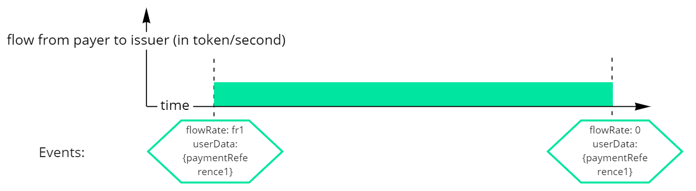
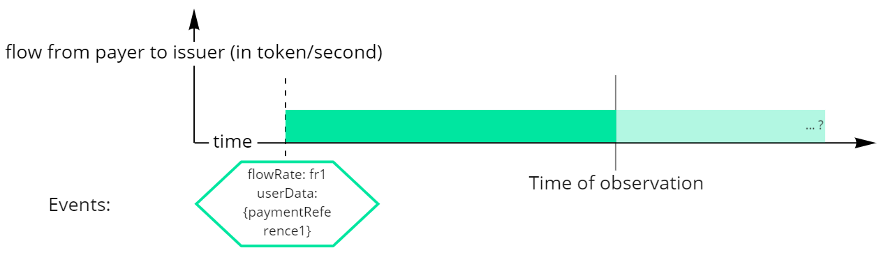
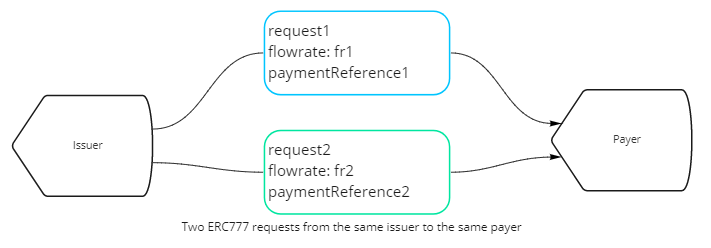
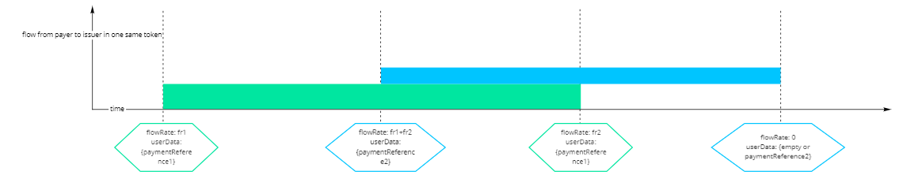
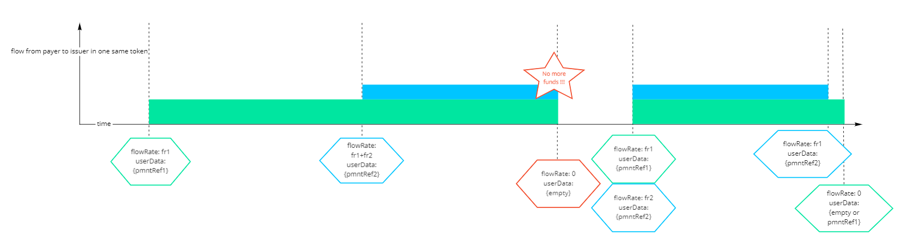
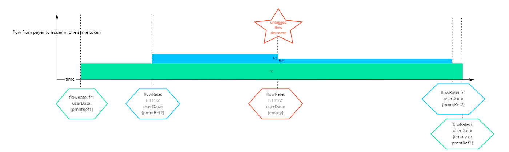

# Payment Network - ERC777 Stream

## Description

This extension allows payments to be made with streams of ERC777 Super tokens (cf. Superfluid Finance). Payments may include fees.
This payment network inherits from the [ERC20 Fee Proxy Contract](./payment-network-erc20-proxy-contract-0.1.0.md) extension.

Many requests can be paid with the same stream, typically recurring requests of fix amount paid continuously. A group of requests payable with the same stream are called a request series, they must all have the same currency. It is possible to pay one series of requests with many streams, but it is not the purpose.

There are 2 kinds of request extensions in order to accept ERC777:

- The first request of a series is very similar to [payment-network-erc20-fee-proxy](./payment-network-erc20-fee-proxy-contract-0.1.0.md), it defines the salt, paymentAddress and requestId to compute the `paymentReference` used for the whole series.
- Other requests must define a `previousRequestId` and cannot redefine any of the payment properties (`paymentAddress`, `feeAddress` or `salt`).

This version 0.1.0 does not allow refunds to be streamed. Refunds have to be made according to [payment-network-erc20-fee-proxy](./payment-network-erc20-fee-proxy-contract-0.1.0.md), using the fact that ERC777 tokens implement the ERC20 interface.

?? remaining questions ??

- impact on reputation
- flow rate < invoicing rate ?

As for [ERC20 Fee Proxy Contract](./payment-network-erc20-proxy-contract-0.1.0.md) requests, the request issuer can also declare payments manually. Fees shall not be paid for declarative payments.

The main payment and the fees payment are made within two different streams, both identified by the same `paymentReference` and stream recipient (`toAddress` for the main payment and `feeAddress` for fees). This `paymentReference` consists of the last 8 bytes of a salted hash of the requestId: `last8Bytes(hash(lowercase(requestId + salt + address)))`:

As a payment network, this extension describes how to deduce a payment `balance` for the request. (see [Interpretation](#Interpretation))

## Manual payment declaration

Manual payment declarations follow the same specifications as [payment-network-erc20-fee-proxy](./payment-network-erc20-fee-proxy-contract-0.1.0.md).

## Properties

### First request of a series

| Property                     | Type      | Description                                      | Requirement   |
| ---------------------------- | --------- | ------------------------------------------------ | ------------- |
| **id**                       | String    | constant value: "pn-erc777-stream"               | **Mandatory** |
| **type**                     | String    | constant value: "paymentNetwork"                 | **Mandatory** |
| **version**                  | String    | constant value: "0.1.0"                          | **Mandatory** |
| **events**                   | Array     | List of the actions performed by the extension   | **Mandatory** |
| **values**                   | Object    |                                                  |               |
| **values.salt**              | String    | Salt for the request                             | **Mandatory** |
| **values.expectedFlowRate**  | Number    | Expected amount of request `currency` per second | Optional      |
| **values.expectedStartDate** | Timestamp | Expected start of stream                         | Optional      |
| **values.paymentAddress**    | String    | Blockchain address for the payment               | Optional      |
| **values.refundAddress**     | String    | Blockchain address for the refund                | Optional      |
| **values.feeAddress**        | String    | Blockchain address for the fee payment           | Optional      |
| **values.feeAmount**         | String    | The fee amount in the request `currency`         | Optional      |

The `expectedStartDate` and `expectedFlowRate` describe the expected payment conditions, which in combination with the request `expectedAmount` fixes the expected payment end date for the give first request of the series.

Two equivalent ways to read the 3 parameters (`expectedStartDate`, `expectedFlowRate` and `expectedAmount`) + 1 fixed paramater (`expectedEndDate`):

- The stream is expected to start in between the `expectedStartDate` and `expectedEndDate`, with a flow equal to `expectedFlowRate`. A (one-shot) transfer is expected to compensate for the period between the `expectedStartDate` and the actual flow start.
- The later the stream starts after the `expectedStartDate`, the worse the payer. The later the balance equals the `expectedAmount` after the `expectedEndDate`, considering one-shot transfers and flows, the worse the payer.

### Following requests of a series

| Property                     | Type   | Description                                     | Requirement   |
| ---------------------------- | ------ | ----------------------------------------------- | ------------- |
| **id**                       | String | constant value: "pn-erc777-stream"              | **Mandatory** |
| **type**                     | String | constant value: "paymentNetwork"                | **Mandatory** |
| **version**                  | String | constant value: "0.1.0"                         | **Mandatory** |
| **events**                   | Array  | List of the actions performed by the extension  | **Mandatory** |
| **values**                   | Object |                                                 |               |
| **values.previousRequestId** | String | requestId of the previous request in the series | **Mandatory** |

---

## Action: Creation of the first request of a series

### Parameters

|                                 | Type & Description | Requirement   |
| ------------------------------- | ------------------ | ------------- |
| **id**                          | cf. Properties     | **Mandatory** |
| **type**                        | \*                 | **Mandatory** |
| **version**                     | \*                 | **Mandatory** |
| **parameters**                  | Object             |               |
| **parameters.salt**             | \*                 | **Mandatory** |
| **parameters.expectedFlowRate** | \*                 | Optional      |
| **parameters.paymentAddress**   | \*                 | Optional      |
| **parameters.refundAddress**    | \*                 | Optional      |
| **parameters.feeAddress**       | \*                 | Optional      |
| **parameters.feeAmount**        | \*                 | Optional      |

### Conditions

This action is valid if:

- The `salt` is not empty and long enough (8 bytes of randomness minimum).
- The `currency.type` is ERC777.

### Warnings

This action must trigger the same warnings as a normal ERC20 Fee Proxy extension creation, inherited from [payment-network-erc20-fee-proxy](./payment-network-erc20-fee-proxy-contract-0.1.0.md).

### Results

The extension state is created with the following properties:

|  Property                   |  Value                                                         |
| --------------------------- | -------------------------------------------------------------- |
| **id**                      | cf. Properties                                                 |
| **type**                    | \*                                                             |
| **version**                 | \*                                                             |
| **values**                  |                                                                |
| **values.paymentAddress**   | `paymentAddress` from parameters if given, undefined otherwise |
| **values.refundAddress**    | `refundAddress` from parameters if given, undefined otherwise  |
| **values.feeAddress**       | `feeAddress` from parameters if given, undefined otherwise     |
| **values.feeAmount**        | `feeAmount` from parameters if given, undefined otherwise      |
| **values.salt**             | cf. Properties                                                 |
| **values.expectedFlowRate** | \*                                                             |
| **events**                  | Array with one 'create' event (see below)                      |

The 'create' event in the extension state **events**:

|  Property      |  Value                                               |
| -------------- | ---------------------------------------------------- |
| **name**       | 'create'                                             |
| **parameters** | the parameters object with possible undefined values |

## Action: Creation of children requests in a series

### Parameters

|                                  | Type & Description | Requirement   |
| -------------------------------- | ------------------ | ------------- |
| **id**                           | cf. Properties     | **Mandatory** |
| **type**                         | \*                 | **Mandatory** |
| **version**                      | \*                 | **Mandatory** |
| **parameters**                   | Object             |               |
| **parameters.previousRequestid** | \*                 | **Mandatory** |

### Conditions

This action is valid if:

- The `previousRequestid` is not empty and references an existing request with the same `currency`
- No request created before references the same request (there cannot be siblings)

### Results

The extension state is created with the following properties:

|  Property                    |  Value                                    |
| ---------------------------- | ----------------------------------------- |
| **id**                       | cf. Properties                            |
| **type**                     | \*                                        |
| **version**                  | \*                                        |
| **values**                   |                                           |
| **values.previousRequestid** | \*                                        |
| **events**                   | Array with one 'create' event (see below) |

The 'create' event in the extension state **events**:

|  Property      |  Value                |
| -------------- | --------------------- |
| **name**       | 'create'              |
| **parameters** | the parameters object |

---

## Action: addPaymentAddress

### Parameters

|                               | Type   | Description                         | Requirement   |
| ----------------------------- | ------ | ----------------------------------- | ------------- |
| **id**                        | String | cf. Properties                      | **Mandatory** |
| **action**                    | String | Constant value: "addPaymentAddress" | **Mandatory** |
| **parameters**                | Object |                                     |               |
| **parameters.paymentAddress** | String | Blockchain address for the payment  | **Mandatory** |

### Conditions

This action is valid, if:

- The extension state with the id "pn-erc777-fee-stream" exists
- The signer is the `payee`
- The extension value `previousRequestId` does not exist
- The extension value `paymentAddress` is undefined

### warnings

None.

### Results

An extension state is updated with the following properties:

|  Property                 |  Value                                               |
| ------------------------- | ---------------------------------------------------- |
| **values.paymentAddress** | `paymentAddress` from parameters                     |
| **events**                | Add an 'paymentAddress' event (see below) at its end |

the 'addPaymentAddress' event:

|  Property                     |  Value                              |
| ----------------------------- | ----------------------------------- |
| **name**                      | Constant value: "addPaymentAddress" |
| **parameters**                |                                     |
| **parameters.paymentAddress** | `paymentAddress` from parameters    |

## Action: addRefundAddress

### Parameters

|                              | Type   | Description                        | Requirement   |
| ---------------------------- | ------ | ---------------------------------- | ------------- |
| **id**                       | String | cf. Properties                     | **Mandatory** |
| **action**                   | String | Constant value: "addRefundAddress" | **Mandatory** |
| **parameters**               | Object |                                    |               |
| **parameters.refundAddress** | String | Blockchain address for the refund  | **Mandatory** |

### Conditions

This action is valid if:

- The extension state with the id "pn-erc777-fee-stream" exists
- The signer is the `payer`
- The extension value `previousRequestId` does not exist
- The extension value `refundAddress` is undefined

### warnings

None.

### Results

The extension state is updated with the following properties:

|  Property                |  Value                                                 |
| ------------------------ | ------------------------------------------------------ |
| **values.refundAddress** | `refundAddress` from parameters                        |
| **events**               | Add an 'addRefundAddress' event (see below) at its end |

The 'addRefundAddress' event:

|  Property                    |  Value                          |
| ---------------------------- | ------------------------------- |
| **name**                     | 'addRefundAddress'              |
| **parameters**               |                                 |
| **parameters.refundAddress** | `refundAddress` from parameters |

## Action: addFee

### Parameters

|                           | Type   | Description                            | Requirement   |
| ------------------------- | ------ | -------------------------------------- | ------------- |
| **id**                    | String | cf. Properties                         | **Mandatory** |
| **action**                | String | Constant value: "addFeeAddress"        | **Mandatory** |
| **parameters**            | Object |                                        |               |
| **parameters.feeAddress** | String | Blockchain address for the fee payment | **Mandatory** |
| **parameters.feeAmount**  | String | The fee amount                         | **Mandatory** |

### Conditions

This action is valid, if:

- The extension state with the id "pn-erc777-fee-stream" exists
- The signer is the `payee`
- The extension value `previousRequestId` does not exist
- The extension value `feeAddress` is undefined
- The extension value `feeAmount` is undefined or represents an integer greater or equal than zero

### warnings

None.

### Results

The extension state is updated with the following properties:

|  Property             |  Value                                   |
| --------------------- | ---------------------------------------- |
| **values.feeAddress** | `feeAddress` from parameters             |
| **values.feeAmount**  | `feeAmount` from parameters              |
| **events**            | Add a 'fee' event (see below) at its end |

the 'addFee' event:

|  Property                 |  Value                          |
| ------------------------- | ------------------------------- |
| **name**                  | Constant value: "addFeeAddress" |
| **parameters**            |                                 |
| **parameters.feeAddress** | `feeAddress` from parameters    |
| **parameters.feeAmount**  | `feeAmount` from parameters     |

## Action: declareReceivedPayment TODO : assign to request or to suite?

### Parameters

|                        | Type   | Description                                                   | Requirement   |
| ---------------------- | ------ | ------------------------------------------------------------- | ------------- |
| **id**                 | String | cf. Properties                                                | **Mandatory** |
| **action**             | String | Constant value: "declareReceivedPayment"                      | **Mandatory** |
| **parameters**         | Object |                                                               |               |
| **parameters.amount**  | Amount | The amount declared as received, in request currency          | **Mandatory** |
| **parameters.note**    | String | Additional information about the payment                      | Optional      |
| **parameters.txHash**  | String | The transaction hash for documentation and metadata           | Optional      |
| **parameters.network** | String | The network of the transaction for documentation and metadata | Optional      |

### Conditions

This action is valid, if:

- The extension state with the id "pn-erc777-fee-stream" exists
- The signer is the `payee`

### warnings

None.

### Results

An event is added to the extension state events array:

|  Property             |  Value                                   |
| --------------------- | ---------------------------------------- |
| **name**              | Constant value: "declareReceivedPayment" |
| **parameters**        |                                          |
| **parameters.amount** | `amount` from parameters                 |
| **parameters.note**   | `note` from parameters                   |
| **parameters.txHash** | `txHash` from parameters or undefined    |

## Action: declareReceivedRefund TODO : assign to request or to suite?

### Parameters

|                        | Type   | Description                                                   | Requirement   |
| ---------------------- | ------ | ------------------------------------------------------------- | ------------- |
| **id**                 | String | cf. Properties                                                | **Mandatory** |
| **action**             | String | Constant value: "declareReceivedRefund"                       | **Mandatory** |
| **parameters**         | Object |                                                               |               |
| **parameters.amount**  | Amount | The amount declared as received, in request currency          | **Mandatory** |
| **parameters.note**    | String | Additional information about the payment                      | Optional      |
| **parameters.txHash**  | String | The transaction hash for documentation and metadata           | Optional      |
| **parameters.network** | String | The network of the transaction for documentation and metadata | Optional      |

### Conditions

This action is valid, if:

- The extension state with the id "pn-erc777-fee-stream" exists
- The signer is the `payee`

### warnings

None.

### Results

An event is added to the extension state events array:

|  Property              |  Value                                  |
| ---------------------- | --------------------------------------- |
| **name**               | Constant value: "declareReceivedRefund" |
| **parameters**         |                                         |
| **parameters.amount**  | `amount` from parameters                |
| **parameters.note**    | `note` from parameters                  |
| **parameters.txHash**  | `txHash` from parameters or undefined   |
| **parameters.network** | `network` from parameters or undefined  |

---

## Interpretation

### Fluctuating balance

The balance of an ongoing payment flow changes every second. Hence, to compute a balance that keeps being in sync, the interpretation returns:

- `lastUpdatedBalance`
- `lastUpdateTimestamp`
- `currentFlowRate`

When the current flow rate is zero (e.g. the payment is finished or not started), the suite balance is a fixed number: `lastUpdatedBalance`. Otherwise, when the payment is in progress, the balance is a function of time:

`balance(t) = lastUpdatedBalance + (t - lastUpdateTimestamp) * currentFlowRate`

Similarly, a request balance is a fixed number if it is paid or if the flow rate is zero.

### Suite balance and request balance

All the requests within the same suite use the same `paymentReference` for balance updates. In order to compute a request balance, we need to know all the preceeding requests in the series. The serie balance is allocated to requests one by one, starting by the first, and up to each `expectedAmount`. We repeat that process up to the current request if possible. If the suite balance is high enough to allocate funds up to the current request, the balance is strictly positive. If the remaining allocated balance falls down to zero before the allocation process reached current request, its balance is zero.

The balance of one request cannot be greater than its expected amount except if we know that there is no more subsequent request in the series. Said another way: only the last request of the series can be overpaid.

In edge case scenarios, a new request is added to the end of the suite after an overpayment. The formerly last request becomes second to last, its balance is reduced to its `expectedAmount` and the remaining balance is allocated to the new request. Said another way: we can pay a suite before it is fully created, and the overpayment status of a suite can be temporary.

### Events

Three types of events have to be interpreted for the suite balance update:

- `FlowUpdated` when payment flows are created, updated or stopped, with agreements "Instant Distribution Agreement" or "Constant Flow Agreement"
  - Case A (**main updates**): payment initiated or updated by the payer, must contain a `paymentReference`
  - Case B (**untagged updates**): the flow is updated by third-party (e.g. the flow is interrupted due to a lack of funds), does not contain the `paymentReference`
  - Assumption: only flow interruptions (`flowRate = 0`) are interpreted as **untagged updates**
- ERC20 payments and refunds: inheriting from [payment-network-erc20-fee-proxy](./payment-network-erc20-fee-proxy-contract-0.1.0.md)
- Manual payment and refund declarations

#### Getting flow update events

We gather events by receiving address (`values.paymentAddress` for the request balance or `values.feeAddress` for the fee balance), with this script:

1. Gather **main updates**: `FlowUpdated` events with the criteria below, sorted by date. Criteria:

   - `recipient === values.paymentAddress` or `recipient === values.feeAddress` (whether we compute the main balance or fee balance)
   - `token === request.currency`
   - `userData === last8Bytes(hash(lowercase(requestId + salt + values.paymentAddress)))`

2. Edge case: if events matching the criteria are sent by more than one payer, group them by payer and treat the rest of this script idependently for each group. At the end, add everything up.

3. To account for a specific `paymentReference`'s flow rate, we look for the **_difference between the previous flow rate and the new one_**. This way, one payer can pay many requests to the same payee, simultaneously within the same stream. This value is called `referencedRate`
4. If the last flow update has `referencedRate = 0`, we will look in 5. for the **untagged updates** in between the first and the last updates
5. If the last flow update has `referencedRate > 0`, we will look in 5. for all the **untagged updates** since the first update
6. Given the time constraints of 4. or 5., **untagged updates** are flow updates where all these conditions are met:

   - `userData !== paymentReference`
   - `flowRate === 0` (cf. below for **untagged flow decreases**)
   - `receiver === values.paymentAddress`
   - `sender === [same sender]`
   - `token === request.currency`

#### Untagged flow increases

**Untagged updates** leading to an increase of the total `flowRate` between the payer and receiver, are ignored.

#### Untagged flow decreases

**Untagged decreasing flow rates**, leading to `flowRate > 0`, are difficult to support, especially when many `paymentReferences` are paid simultaneously between the same payer and receiver. They should be avoided within a standard flow. Users should use a different wallet if they want to stream money aside Request. When they happen, and to not leave requests stuck with unclear balances, **untagged decreases** should be arbitrarily tagged to the most recent **main updates**, starting with the most recent one and continuing further back in history in order to "consume" the whole decrease.

? What if a sentinel kills a flow after the request is paid, should it loop indefinetly?

### A - Computing the suite balance

1. Gather all flow update events, sort them by date. => These are `paymentFlows`
2. Compute the sum up to the most recent payment flow (flow rate \* flow timespan for finished timespans) => This is the `lastUpdatedFlowBalance`
3. Substract from the `lastUpdatedFlowBalance` the sum of detected refunds and the sum of declared received refunds, add the sum of declared received payments => This is the `lastUpdatedBalance`
4. The most recent flow update transaction timestamp is the `lastUpdateTimestamp`
5. The most recent flow update `flowRate` is the `currentFlowRate`

### B - Computing a request balance

1. Sum up the `expectedAmount` of all previous requests => `sumOfPreviousExpectedAmount`
2. If `sumOfPreviousExpectedAmount + expectedAmount <= lastUpdatedBalance` and the request is not the last one of the suite, we can interpret `requestBalance = expectedAmount`
3. If `currentFlowRate == 0`, we can compute a request balance with `lastUpdatedBalance - sumOfPreviousExpectedAmount` if it is positive, `zero` otherwise, and capping this value to `expectedAmount` if the request is not the last one of its series
4. If `currentFlowRate > 0`, we cannot compute a fix request balance. Each second, we need to apply the logic above replacing `lastUpdatedBalance` with `lastUpdatedBalance + currentFlowRate \* (current timestamp - lastUpdateTimestamp)`

### C - Adaptation for fee balances

Apply exactly the same steps from A and B but:

- adapting the flow filter to fetch flow update events matching `values.feeAddress`
- and replacing `expectedAmount` with `values.feeAmount` coming from the first request of the suite

## Visual interpretation

We can represent a request flow payment with the area of a rectangle in between two events emitted with the correct userData:

When we interpret the balance while the stream is in progress:

Let's consider two requests with the same payer and issuer.

In the ideal flow, we have 4 events. Notice that the 2nd event's `flowRate` is the sum of both payment rates.

The balance interpretation should take untagged events into account, for example when the payer runs out of funds.

Interpreting a partial untagged decrease is not ideal and should be avoided. The decrease is associated with the history of tagged updates in reverse order of detection.

